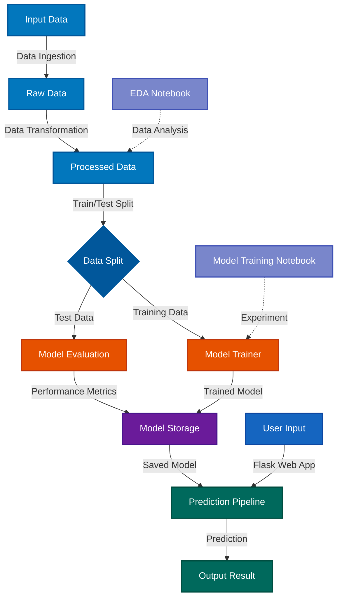

# End to End Machine Learning Project 

## Project Architecture



## Project Structure

```
ml-pipeline-startup-analysis/
│
├── src/                          # Main source code
│   ├── components/               # Core ML components
│   │   ├── data_ingestion.py    # Data input handling
│   │   ├── data_transformation.py# Data preprocessing & feature engineering
│   │   └── model_trainer.py     # Model training logic
│   ├── pipelines/               # ML workflow pipelines
│   │   ├── train_pipeline.py    # Training pipeline
│   │   └── predict_pipeline.py  # Inference pipeline
│   ├── logger.py                # Logging utilities
│   ├── exception.py             # Custom exceptions
│   └── utils.py                 # Helper functions
│
├── notebook/                     # Jupyter notebooks
│   ├── EDA.ipynb                # Exploratory Data Analysis
│   └── Model Training.ipynb     # Model experimentation
│
├── templates/                    # Flask HTML templates
│   ├── home.html
│   └── index.html
│
├── app.py                        # Flask web application
├── setup.py                      # Package setup
├── requirements.txt              # Project dependencies
└── README.md                     # This file
```

## Workflow

1. **Data Ingestion** → Load and validate raw data
2. **Data Transformation** → Clean, preprocess, and engineer features
3. **Model Training** → Train ML models (CatBoost, XGBoost, Scikit-learn)
4. **Model Evaluation** → Validate model performance
5. **Prediction Pipeline** → Deploy model for inference
6. **Flask Web App** → User-friendly interface for predictions

## Technology Stack

- **Data Processing**: pandas, numpy
- **Visualization**: seaborn, matplotlib
- **Machine Learning**: scikit-learn, CatBoost, XGBoost
- **Web Framework**: Flask
- **Serialization**: dill