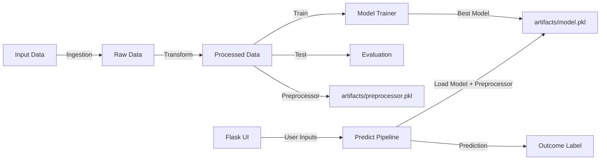

# Startup Success Prediction - End-to-End ML Pipeline

This project predicts startup outcomes using a full machine learning pipeline and a Flask web interface.

The app takes startup business/founder inputs and predicts one of these outcomes:
- Acquisition
- Failure
- IPO

---

## 1) What This Project Includes

- Data ingestion from CSV dataset
- Data transformation with preprocessing pipelines
- Model training with multiple algorithms and hyperparameter search
- Best model selection and model artifact saving
- Prediction pipeline for inference
- Flask web UI for interactive predictions
- Error handling and logging support

---

## 2) Architecture



---

## 3) Project Structure

```
ml-pipeline-startup-analysis/
│
├── app.py
├── requirements.txt
├── setup.py
├── README.md
│
├── notebook/
│   ├── EDA.ipynb
│   ├── Model Training.ipynb
│   └── data/startup_success_dataset.csv
│
├── templates/
│   ├── index.html                 # Landing page
│   └── home.html                  # Prediction form + result
│
├── artifacts/                     # Generated after training
│   ├── data.csv
│   ├── train.csv
│   ├── test.csv
│   ├── preprocessor.pkl
│   └── model.pkl
│
└── src/
        ├── logger.py
        ├── exception.py
        ├── utils.py
        ├── components/
        │   ├── data_ingestion.py
        │   ├── data_transformation.py
        │   └── model_trainer.py
        └── pipelines/
                ├── train_pipeline.py
                └── predict_pipeline.py
```

---

## 4) Tech Stack

- Python
- pandas, numpy
- scikit-learn
- xgboost
- catboost (available in dependencies)
- Flask
- dill/pickle for serialization

---

## 5) Setup Instructions

### 5.1 Clone and enter project

```bash
git clone <your-repo-url>
cd ml-pipeline-startup-analysis
```

### 5.2 Create virtual environment

Windows (PowerShell):
```powershell
python -m venv .venv
.\.venv\Scripts\Activate.ps1
```

Mac/Linux:
```bash
python -m venv .venv
source .venv/bin/activate
```

### 5.3 Install dependencies

```bash
pip install -r requirements.txt
```

---

## 6) Training the Model

You can run training using either:

```bash
python src/components/data_ingestion.py
```

or:

```bash
python -m src.pipelines.train_pipeline
```

This generates/updates artifacts:
- artifacts/train.csv
- artifacts/test.csv
- artifacts/preprocessor.pkl
- artifacts/model.pkl

---

## 7) Run the Flask App

```bash
python app.py
```

Open browser at:
- http://127.0.0.1:5000

Routes:
- / : landing page
- /predictdata : prediction form (GET) + inference submit (POST)

---

## 8) Input Features Used by Prediction

The prediction form requires all fields:

Numerical:
- funding_rounds
- founder_experience_years
- team_size
- market_size_billion
- product_traction_users
- burn_rate_million
- revenue_million

Categorical:
- investor_type (none, angel, tier1_vc, tier2_vc)
- sector (AI, SaaS, Fintech, Health, Ecommerce, Climate, Crypto)
- founder_background (first_time, serial_founder, ex_bigtech, academic)

---

## 9) Predicted Classes and Meaning

The model internally predicts class codes, then UI maps them to labels:

- 0 -> Acquisition
- 1 -> Failure
- 2 -> IPO

The UI displays both human-readable label and model class code.

---

## 10) Best Model Selection Logic

Training evaluates models from a dictionary in model_trainer.py using hyperparameter search in utils.py.

Flow:
1. Evaluate all models in dictionary
2. Build report of model -> test score
3. Select highest score
4. Save selected estimator to artifacts/model.pkl

Prediction always loads artifacts/model.pkl.

---

## 11) Logging and Errors

- Logs are saved under logs/
- Custom exceptions include file and line info to simplify debugging
- Prediction route catches backend errors and shows message in UI instead of plain 500 crash

---

## 12) Common Troubleshooting

### ModuleNotFoundError: No module named src
- Run from project root
- Or use module execution style:
    - python -m src.pipelines.train_pipeline

### Internal Server Error on Predict
- Ensure artifacts/model.pkl exists
- Ensure artifacts/preprocessor.pkl exists
- Re-run training pipeline if missing

### Training takes too long / interrupted
- Model search includes multiple algorithms and hyperparameter grids
- On lower resources, run can take significant time

### Predicted Outcome shows number
- Class codes map to labels:
    - 0 Acquisition
    - 1 Failure
    - 2 IPO

---

## 13) Quick Demo Inputs

Use these values in the web form at /predictdata for quick local testing.

| Case | funding_rounds | founder_experience_years | team_size | market_size_billion | product_traction_users | burn_rate_million | revenue_million | investor_type | sector | founder_background | Expected Outcome |
|------|----------------|--------------------------|-----------|---------------------|------------------------|-------------------|-----------------|---------------|--------|--------------------|------------------|
| A | 8 | 15 | 120 | 30.0 | 1200000 | 4.0 | 20.0 | tier1_vc | AI | serial_founder | Acquisition |
| B | 1 | 1 | 5 | 0.8 | 1200 | 3.5 | 0.05 | none | Crypto | first_time | Failure |
| C | 10 | 13 | 175 | 25.89 | 1546807 | 4.5 | 24.75 | none | Climate | serial_founder | IPO |

Note:
- These outcomes are based on the currently saved local model artifact.
- If you retrain the model, predictions can change.

---

## 14) Suggested Improvements

- Persist class encoder with model artifact
- Add confidence/probability scores in UI
- Add automated tests for pipeline and routes
- Add API endpoint for JSON prediction
- Add Docker support for one-command deployment

---

## 15) License

Add your project license here (MIT, Apache-2.0, etc.) if needed.